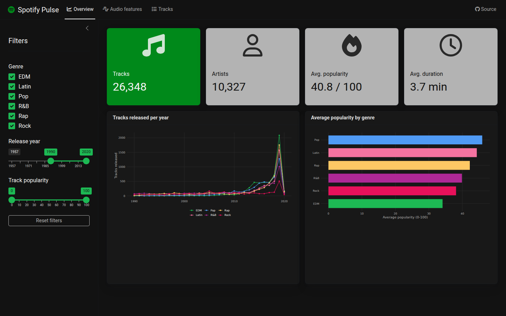
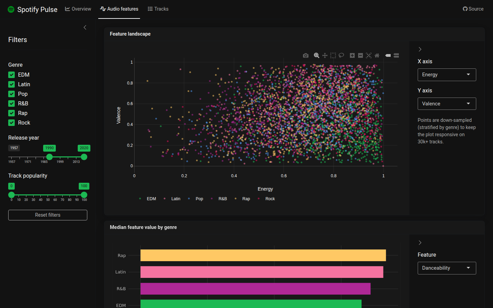
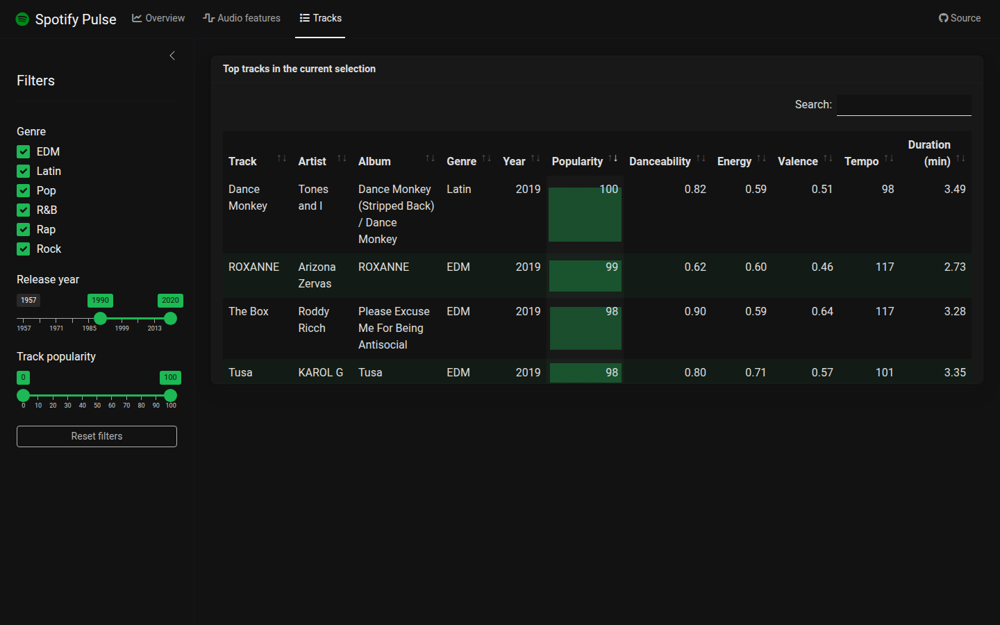

# Spotify Pulse

[](https://github.com/bensaspensas/spotify-pulse/actions/workflows/ci.yml)
[](LICENSE)

A production-style **R Shiny** dashboard exploring the audio landscape of
**30,000+ Spotify tracks** — genres, popularity trends and audio features —
built to demonstrate how I structure real Shiny work: modular code, fast
data.table aggregations, interactive ggiraph/plotly graphics, unit + end-to-end
tests, CI and Docker.



## What it shows

| Tab | Contents |
| --- | --- |
| **Overview** | KPI value boxes and interactive (hover-linked) release/popularity trends per genre, rendered with `ggiraph` |
| **Audio features** | A genre-coloured `plotly` scatter of any two audio features, plus per-genre median feature profiles |
| **Tracks** | A searchable `DT` table of the top tracks in the current selection, with inline popularity bars |

A shared sidebar (Shiny module) filters every tab at once by genre, release
year and track popularity.




## Architecture

```
app.R                     entry point: UI shell (bslib page_navbar) + server wiring
R/
├── data.R                raw -> prepared transformation, on-disk .rds cache
├── utils_aggregate.R     pure data.table helpers behind every chart/KPI (unit-tested)
├── theme.R               bslib theme + matching ggplot2/girafe/plotly styling
├── mod_filters.R         sidebar filter module (returns validated filter values)
├── mod_overview.R        KPI + trends tab module
├── mod_features.R        audio-feature exploration tab module
└── mod_tracks.R          top-tracks table tab module
data-raw/                 raw TidyTuesday extract + reproducible prep script
data/                     prepared .rds cache (rebuilt by data-raw/prepare_data.R)
tests/testthat/           unit tests (pure helpers) + shinytest2 end-to-end smoke test
.github/workflows/ci.yml  tests + Docker build on every push/PR
Dockerfile                rocker/shiny-based image
```

Design decisions worth calling out:

* **Separation of concerns.** Everything a chart needs is computed by a pure,
  Shiny-free function in `R/utils_aggregate.R`. Those functions are trivially
  unit-testable; the modules only wire reactivity and rendering.
* **Performance.** The raw csv is prepared once (year parsing, de-duplication)
  and cached as `.rds`; all aggregation is keyed `data.table`; the shared
  filtered table is `bindCache()`d on the filter values; scatter points are
  down-sampled with a genre-stratified, deterministic sampler so the client
  stays responsive.
* **One row per (track, genre).** The raw extract has one row per *playlist*
  appearance, which would skew genre statistics; de-duplication is handled —
  and tested — in `prepare_songs()`.

## Running locally

Requires R >= 4.3 with the packages listed in `DESCRIPTION`:

```r
install.packages(c("shiny", "bslib", "data.table", "ggplot2",
                   "ggiraph", "plotly", "DT"))
shiny::runApp()
```

## Running with Docker

```sh
docker build -t spotify-pulse .
docker run --rm -p 3838:3838 spotify-pulse
# open http://localhost:3838/spotify-pulse/
```

## Tests

Unit tests cover the data preparation and every aggregation helper; a
`shinytest2` smoke test boots the real app in headless Chrome, checks the
KPIs render, changes a filter and asserts the outputs react (including the
empty-selection validation path).

```sh
Rscript tests/testthat.R           # unit + app tests (app test needs Chrome)
```

Both suites plus the Docker image build run in GitHub Actions on every push.

## Data

[TidyTuesday 2020-01-21](https://github.com/rfordatascience/tidytuesday/tree/master/data/2020/2020-01-21)
— ~33k songs pulled from the Spotify Web API via
[{spotifyr}](https://www.rcharlie.com/spotifyr/), covering six playlist genres
with audio features (danceability, energy, valence, …), popularity and release
dates. `data-raw/prepare_data.R` reproduces the prepared dataset from the raw
extract.

## License

MIT © Benediktas Poviliūnas. Not affiliated with Spotify; data is used for
demonstration purposes only.
